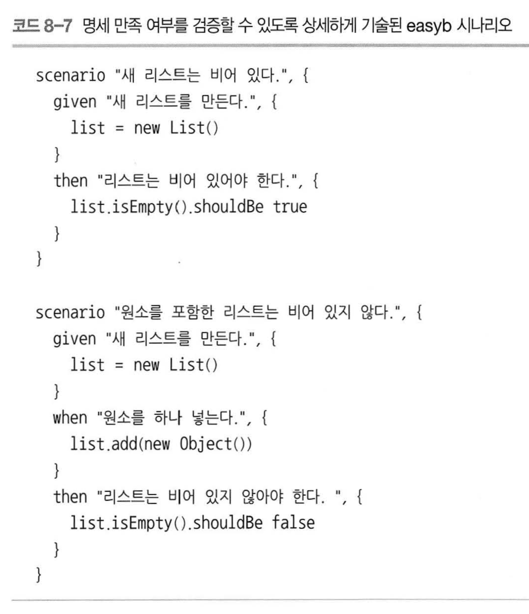

# Chapter 8 제2의 JVM 언어를 활용한 테스트 작성  

- 자바 이외에 JVM 위에서 구동되는 다른 언어들을 적절하게 사용하면 테스트 작성시에도 이점을 얻을 수 있다.
    1. 자질구레한 문법이 적어 핵심 로직이 잘  드러난다.
    2. 더 읽기 쉬운 데이터 구조(컬렉션)을 제공한다.
    3. 표준 데이터 타입을 편하게 다를 수 있는 메서드를 추가로 제공한다.
    4. 더 강력한 기능을 언어차원에서 지원한다.
- ex) 그루비, 스칼라, 루비...

- 성능은 좀 떨어지더라도 **가독성**면에서 좋은 언어들이 많다. 테스트는 성능에 민감하지 않기 때문에 이러한 Trade-off 를 살려서 가독성이 한결 좋아진 테스트코들르 작성 할 수 있다.
- 실제 프로덕션 코드와 테스트 코드를 다른 언어를 사용 할 수 있다. 그렇기 때문에 다른 언어를 쉽게 입문하게 되는 '미끼'효과도 있다.

- **테스트 -> 명세(스펙), 테스트 메서드 -> 행위(동작)**이라는 용어가 거론 되었다.
- BDD 프레임워크인 easyb나 스폭를 사용하면 좀 더 평서문처럼 **읽기 편한** 즉, 가독성이 좋아지는 효괄르 볼 수 있다. 소스가 평서문에 가깝다.

  